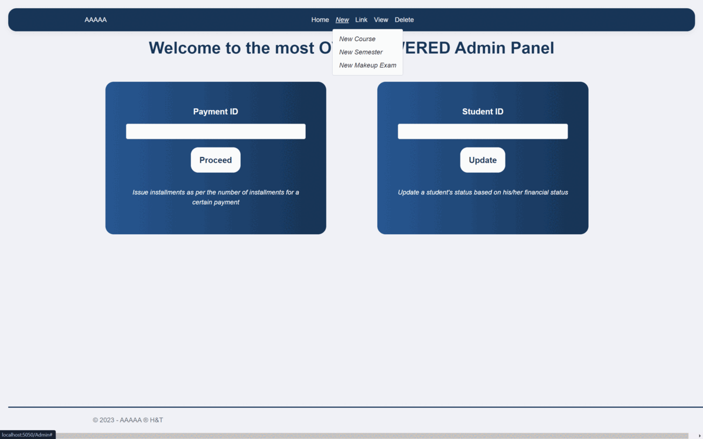

A comprehensive platform designed to serve both students and their advisors, providing multiple privileges to streamline the advising experience, all monitored through a sufficient admin dashboard.

## Table of Contents

- 🧑‍💻 [Tech Stack](#tech-stack)
- 🛫 [Main Features](#main-features)
  - [Admin Panel](#admin-panel)
  - [Student Panel](#stduent-panel)
  - [Advisor Panel](#advisor-panel)
- 🔨 [Try it on your Machine](#try-it-on-your-machine)
- 🤝 [Contributers](#contributors)

## Tech Stack🧑‍💻


Here's a brief high-level overview of the tech stack the website uses:

- This project utilizes **ASP.NET** Core with .NET 8 as the target framework to manage the backend and route different HTTP requests.
- .NET Core was chosen over .NET Framework because it's designed to be **cross-platform**, running on Windows, Linux, and macOS. Additionally, it offers significant **performance improvements**.
- For the **DataBase**, we opted for Microsoft SQL Server to handle various CRUD operations (Create, Read, Update, and Delete) using SQL stored procedures and functions.
- **Razor Pages** were employed to streamline page-focused scenarios, offering enhanced productivity compared to using controllers and views due to the relative simplicity of the website.
- On the **FrontEnd**, we employed HTML, CSS, and Bootstrap, leveraging the Razor syntax to integrate C# instead of JavaScript, thus facilitating a smoother development process.

## Main Features🛫

The website offers various features and functionalities through the main three panels.

### Admin Panel

To access the admin panel, click on **Admin** in the bottom left corner, then log in with **ID = 1** and **Password = admin**, both of which are hardcoded.


From the home page, the admin can navigate through the different sections via the top menu bar.



The admin can easily access different sets of information and view them in an organized tabular form.


Admin can also alter and modify the existing data by specifying the required parameters through the corresponding forms.


### Stduent Panel

### Advisor Panel

## Try it on your Machine🔨

The easiest and most straightforward way to run the fully functional website locally, avoiding weird and random bugs, is to run it through **Visual Studio**.

1. Install [Visual Studio Community Edition](https://visualstudio.microsoft.com/vs/community/) and make sure to include **ASP\.NET and web development** and **Data storage and processing** workloads.


2. Clone the repository on your local machine by running the following Git command:

    ```bash
    git clone https://github.com/AliShokryy/Advising-Database-System
    ```

3. Navigate to the repository root folder, then open the solution file with Visual Studio by running the following command:

    ```bash
    cd Advising-Database-System; start Team6_Advising.sln
    ```

4. Finally, create the database and run the website locally by following these simple steps:
   - Connect to MSSQLLocalDB, then execute the SQL queries in **DB_Schema.sql** to create an instance of the Advising_System database with all the needed tables, procedures, and functions.
   - Run the web server by pressing **F5**.
   - Go to [http://localhost:5050](http://localhost:5050).


## Contributors🤝

- Admin Panel: [Ahmed Hawater](https://github.com/AhmedHawater2003) **|** [Abdelrahman M.Talaat](https://github.com/Talaat-jr)
- Student Panel: [Abdullah Mahmoud](https://github.com/dodzii) **|** [Ahd Mostafa](https://github.com/AhdMostafa0)
- Advisor Panel: [Ali Shokry](https://github.com/AliShokryy)
